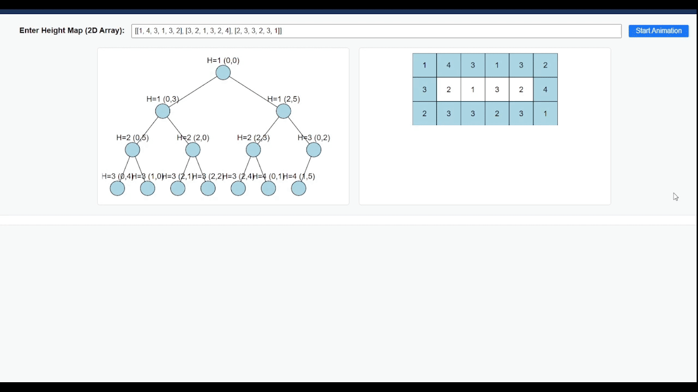
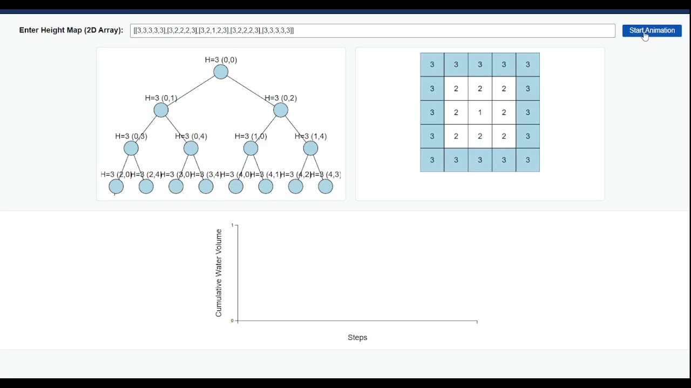

# 407. Trapping Rain Water II

Given an `m x n` integer matrix `heightMap` representing the height of each unit cell in a 2D elevation map,  
return the volume of water it can trap after raining.

**Constraints:**

- `m == heightMap.length`
- `n == heightMap[i].length`
- `1 <= m, n <= 200`
- `0 <= heightMap[i][j] <= 2 * 10^4`

## 基礎思路

1. **最小堆**：利用最小堆來追蹤當前最小的高度，確保每次處理的都是目前能影響水量的最低高度。
2. **廣度優先搜尋（實際上更貼近 Dijkstra 思路）**：每次處理堆中最低高度的單元，嘗試將鄰居單元的高度加入堆中，並計算可能的儲水量。

> **為何稱「更貼近 Dijkstra」？**  
> 傳統的 BFS 通常使用 Queue 先進先出、不涉及權重。此題使用「最小堆」讓每次擴張都從「當前最低水位」開始，過程更接近 Dijkstra 的「多源最短路徑」，只是大部分教學慣用「BFS」來描述此擴散流程，故仍保留此稱呼。

具體做法：
- 先將所有「邊界」的高度加入最小堆並標記為已訪問。
- 從最小堆中取出最低高度的單元，嘗試向鄰居擴散：
   - 若鄰居高度較低，則可儲水：儲水量是高度差，並更新鄰居的高度（即「被填滿」的概念）。
   - 若鄰居高度較高，僅將它加入最小堆即可。
- 不斷重複，直到堆中元素處理完畢，計算出所有可儲水量的總和。

> **為什麼需要更新鄰居的高度？**  
> 更新鄰居高度的目的是為了模擬「水會填滿低於當前高度的區域」。
> 1. **水位總是以邊界為基準**：低洼區域的水位不能超過邊界的最低高度，因為水會從更低的地方流出去。如果鄰居高度低於當前高度，就需要將其高度更新為當前高度，代表「已被水填滿至該高度」。
> 2. **防止水流出**：若不更新鄰居的高度，演算法可能誤判這些已被填水的區域還能二度儲水。
> 3. **確保模擬過程正確**：每次更新鄰居高度，等於向內推進「最低的邊界」，並繼續以最小堆的機制維持正確的水位擴散。

### 範例分解

1. **輸入**:
    ```typescript
    const heightMap = [
      [1, 4, 3, 1, 3, 2],
      [3, 2, 1, 3, 2, 4],
      [2, 3, 3, 2, 3, 1]
    ]
    ```

2. **邊界高度**:
   - 初始邊界高度為：

   | - | 0     | 1     | 2     | 3     | 4     | 5     |
      |---|-------|-------|-------|-------|-------|-------|
   | 0 | **1** | **4** | **3** | **1** | **3** | **2** |
   | 1 | **3** |       |       |       |       | **4** |
   | 2 | **2** | **3** | **3** | **2** | **3** | **1** |

   這些高度先行加入最小堆，並標記為已訪問。

3. **初始處理**:
   - 將邊界高度加入最小堆。
   - 每次從堆中取出最低高度單元，處理其鄰居：
      - 若鄰居高度比當前高度低，計算儲水量並更新鄰居高度為當前高度。
      - 若鄰居高度高於當前高度，直接將鄰居加入堆。

4. **模擬過程**:
   - 例如，處理 (0, 0) 的高度 1，其鄰居為 (0, 1) 和 (1, 0)：
      - (0, 1): 高度為 4，高於 1，無法儲水，直接將其加入堆。
      - (1, 0): 高度為 3，高於 1，無法儲水，直接將其加入堆。

5. **最終結果**:
   - 當所有單元處理完成後，累計的儲水量為 **4**。

### 示意圖





自由輸入測試案例，可觀察演算法運作過程。到[這裡](https://whats2000.github.io/DailyLeetCode/407-Trapping%20Rain%20Water%20II/heap-visualization/index.html)可以看到最小堆的動畫。

## 解題步驟

### Step 1: 定義 MinHeap 類別

```typescript
/**
 * A basic MinHeap implementation for the problem
 */
class MinHeap<T> {
  /**
   * The heap array where elements are stored
   * @private
   */
  private readonly heap: T[];
  /**
   * The comparator function used to order the elements in the heap
   * @private
   */
  private readonly comparator: (a: T, b: T) => number;

  /**
   * Creates a new MinHeap
   * @param comparator The comparator function used to order the elements in the heap
   */
  constructor(comparator: (a: T, b: T) => number) {
    this.heap = [];
    this.comparator = comparator;
  }

  /**
   * Pushes a new value into the heap
   * @param value The value to push
   */
  push(value: T): void {
    this.heap.push(value);
    this.heapifyUp(this.heap.length - 1);
  }

  /**
   * Pops the smallest value from the heap
   * @returns The smallest value in the heap
   */
  pop(): T | undefined {
    if (this.size() === 0) return undefined;
    if (this.size() === 1) return this.heap.pop();
    const root = this.heap[0];
    this.heap[0] = this.heap.pop()!;
    this.heapifyDown(0);
    return root;
  }

  /**
   * Returns the smallest value in the heap
   * @returns The smallest value in
    */
  peek(): T | undefined {
    return this.heap[0];
  }

  /**
   * Returns the size of the heap
   * @returns The size of the heap
   */
  size(): number {
    return this.heap.length;
  }

  /**
   * Restores the heap property by moving the element up
   * @param index The index of the element to move up
   * @private
   */
  private heapifyUp(index: number): void {
    while (index > 0) {
      const parentIndex = Math.floor((index - 1) / 2);
      if (this.comparator(this.heap[index], this.heap[parentIndex]) >= 0) break;
      [this.heap[index], this.heap[parentIndex]] = [this.heap[parentIndex], this.heap[index]];
      index = parentIndex;
    }
  }

  /**
   * Restores the heap property by moving the element down
   * @param index The index of the element to move down
   * @private
   */
  private heapifyDown(index: number): void {
    const size = this.size();
    while (index < size) {
      let smallest = index;
      const leftChild = 2 * index + 1;
      const rightChild = 2 * index + 2;

      if (leftChild < size && this.comparator(this.heap[leftChild], this.heap[smallest]) < 0) {
        smallest = leftChild;
      }
      if (rightChild < size && this.comparator(this.heap[rightChild], this.heap[smallest]) < 0) {
        smallest = rightChild;
      }
      if (smallest === index) break;

      [this.heap[index], this.heap[smallest]] = [this.heap[smallest], this.heap[index]];
      index = smallest;
    }
  }
}
```
這是個基本的最小堆實現，我們可以使用它來追蹤當前最小的高度。

### Step 2: 定義搜尋方向

```typescript
const MOVE_DIRECTIONS = [
  { dx: 0, dy: 1 },
  { dx: 1, dy: 0 },
  { dx: 0, dy: -1 },
  { dx: -1, dy: 0 },
];
```

### Step 3: 檢查 Edge Case

```typescript
// 取得矩陣的行和列
const m = heightMap.length;    // m 是矩陣的行數
const n = heightMap[0].length; // n 是矩陣的列數

// 如果矩陣的行或列小於 3，則無法儲水
if (m < 3 || n < 3) return 0;
```

### Step 4: 初始化最小堆

```typescript
// 把所有的格子都標記為未訪問
const visited = Array.from({ length: m }, () => Array(n).fill(false));
// 初始化最小堆，比較函數是根據高度來比較
const minHeap = new MinHeap<{ height: number; row: number; col: number }>(
  (a, b) => a.height - b.height
);
```

### Step 5: 將邊界高度加入最小堆

```typescript
for (let i = 0; i < m; i++) {
  for (let j = 0; j < n; j++) {
    // 如果不是邊界，則跳過
    if (i !== 0 && i !== m - 1 && j !== 0 && j !== n - 1) {
      continue;
    }

    // 把邊界的高度加入最小堆
    minHeap.push({ height: heightMap[i][j], row: i, col: j });

    // 標記為已訪問
    visited[i][j] = true;
  }
}
```

### Step 6: 開始廣度優先搜索（Dijkstra-like）

```typescript
let trappedWater = 0;

// 開始「最小堆」式的搜索
while (minHeap.size() > 0) {
  // 取出當前最小高度的方格
  const { height, row, col } = minHeap.pop()!;

  // 檢查當前方格的鄰居
  for (const { dx, dy } of MOVE_DIRECTIONS) {
    const newRow = row + dx;
    const newCol = col + dy;

    // 跳過邊界和已訪問的方格
    if (
      newRow < 0 ||
      newRow >= m ||
      newCol < 0 ||
      newCol >= n ||
      visited[newRow][newCol]
    ) {
      continue;
    }

    // 標記為已訪問
    visited[newRow][newCol] = true;

    // 計算儲水量，儲水量是當前方格和鄰居方格的高度差
    trappedWater += Math.max(0, height - heightMap[newRow][newCol]);

    // 把鄰居方格的高度加入最小堆
    minHeap.push({
      height: Math.max(height, heightMap[newRow][newCol]),
      row: newRow,
      col: newCol,
    });
  }
}
```

### Step 7: 返回結果

```typescript
return trappedWater;
```

## 時間複雜度

1. **初始化最小堆**
   - 邊界單元約 $O(m + n)$，推入堆操作約 $O(k \log k)$，但這部分相對整體不算大。

2. **主體搜索**
   - 理論上，整個地圖的每個格子最多只會被放入堆一次，因此 $k \approx m \times n$。
   - 每次 push/pop 需要 $O(\log(m \times n))$ 時間。
   - 綜合下來，整體為 $O(m \times n \log (m \times n))$。

3. 總時間複雜度為 $O(m \times n \log (m \times n))$。

> $O(m \times n \log (m \times n))$。

## 空間複雜度

- 堆的大小在最壞情況下可達 $O(m \times n)$。
- `visited` 矩陣亦為 $O(m \times n)$。
- 空間複雜度為 $O(m \times n)$。

> $O(m \times n)$。
