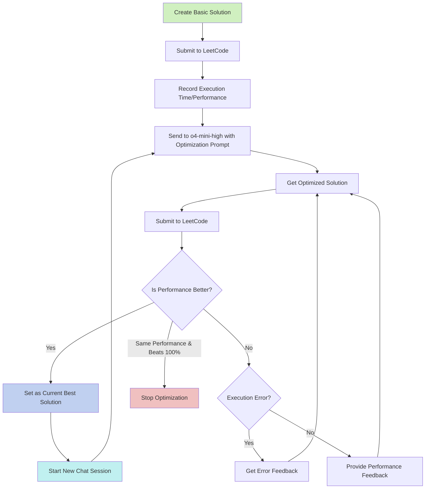

# Daily LeetCode

This repository contains my solutions to the problems on LeetCode. 
I will try to solve at least one problem every day if I have time. 
I will be using TypeScript for all the solutions.
There will also be a Note in Traditional Chinese to explain my solution.

## Solution Optimization Process

My approach to solving and optimizing LeetCode problems follows this process:

1. Create a basic solution that correctly solves the problem
2. Leverage `o4-mini-high` model to iteratively optimize the solution using a specialized prompt

The optimization flow works as follows:



### Optimization Prompt

For each optimization iteration, I use the following prompt:

```
I want to optimize this code for the efficiency of execution time. 

You need to consider the following
1. Operation time in Typescript, sometimes, even if the complexity is low, the operation takes a lot of overhead, which might have a negative effect
2. Use efficient data structures like type array instead of number array, as the program might need to handle significantly large cases.
3. If the code needs to query multiple times, you might consider memory and pre-compute the task for a fast O(1) query.  And store outside the function. Like prefix sum or factor
4. In most cases, math can help to solve it by combining!
5. Consider the constraint, designing a well-fit solution is better
6. Do not change the main function name/function parameter, as it may invoke an error
7. Use a full name other than a shortcut for readability 

Now consider the question and the following code; try to optimize it as fast as possible.
Your task will be marked as a failure if your run time performance is worse than the base code.

The following is the base code and the question
---
{Question}

{Constraints}

{Last Attempt Best Solution}
```

The optimization process continues iteratively with these important rules:

- When a better solution is found, we always start a new chat session with the improved solution as the new baseline
- Error fixes and performance feedback continue in the same chat session
- We only stop iterations when the solution reaches 100% runtime efficiency AND new optimization attempts yield the same performance (bottleneck reached)
- The process aims to push solutions to their theoretical limits through continuous refinement
