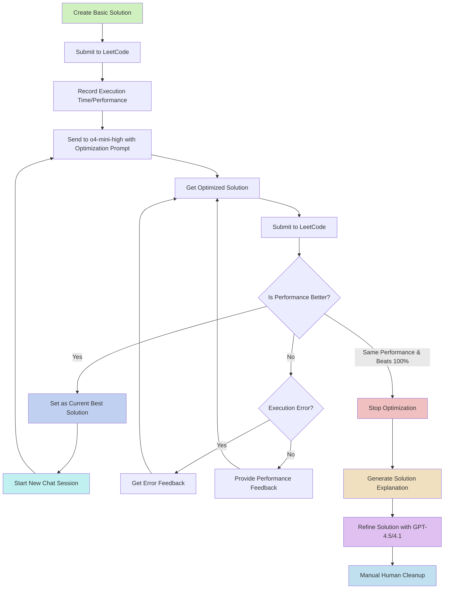

<h1 align="center">Tw-LeetCode</h1>

<p align="center">
    <a href="https://huggingface.co/datasets/twinkle-ai/tw-leetcode"></a>
    <a href="https://github.com/ai-twinkle/tw-leetcode/blob/main/LICENSE"></a>
</p>

<p align="center">
    <a href="https://discord.gg/Cx737yw4ed">
        
    </a>
    <a href="https://huggingface.co/twinkle-ai">
        
    </a>
    <a href="https://linkedin.com/company/twinkle-ai">
        
    </a>
</p>

---

## Overview

This dataset contains the solutions to the problems on LeetCode.

- Update Frequency: At least one problem every day.
- Language: TypeScript
- Model: Solutions and explanations are generated using OpenAI's GPT-4.5 and GPT-4.1 models with human cleanup.
- Question Code Source: TypeScript starter code is extracted from the [whiskwhite/leetcode-complete](https://huggingface.co/datasets/whiskwhite/leetcode-complete) dataset. Missing problems not covered by this dataset are manually collected to ensure completeness.

---

## Solution Optimization Process

The approach to solving and optimizing LeetCode problems follows this process:

1. Create a basic solution that correctly solves the problem
2. Leverage `o4-mini-high` model to iteratively optimize the solution using a specialized prompt

The optimization flow works as follows:



---

## Optimization Prompt

For each optimization iteration, I use the following prompt:

```
I want to optimize this code for the efficiency of execution time. 

You need to consider the following
1. Operation time in Typescript, sometimes, even if the complexity is low, the operation takes a lot of overhead, which might have a negative effect
2. Use efficient data structures like type array instead of number array, as the program might need to handle significantly large cases.
3. If the code needs to query multiple times, you might consider memory and pre-compute the task for a fast O(1) query.  And store outside the function. Like prefix sum or factor
4. In most cases, math can help to solve it by combining!
5. Consider the constraint, designing a well-fit solution is better
6. Do not change the main function name/function parameter, as it may invoke an error
7. Use a full name other than a shortcut for readability 

Now consider the question and the following code; try to optimize it as fast as possible.
Your task will be marked as a failure if your run time performance is worse than the base code.

The following is the base code and the question
---
{Question}

{Constraints}

{Last Attempt Best Solution}
```

---

## Optimization Process

The optimization process continues iteratively with these important rules:

- When a better solution is found, we always start a new chat session with the improved solution as the new baseline
- Error fixes and performance feedback continue in the same chat session
- We only stop iterations when the solution reaches 100% runtime efficiency AND new optimization attempts yield the same performance (bottleneck reached)
- The process aims to push solutions to their theoretical limits through continuous refinement

---

## Solution Explanation and Cleanup

After optimization is complete, the following additional steps are performed:

1. **Generate Solution Explanation**: Use the solution prompt in [solution_prompt.txt](./solution_prompt.txt) with the `o4-mini-high` model to create detailed solution steps and explanations

2. **Solution Refinement**: Leverage ChatGPT-4.5 or ChatGPT-4.1 to refine the generated solution explanations for clarity and completeness

3. **Manual Review and Cleanup**: Perform a human review of the solution markdown to ensure:
   - Technical correctness of the solution
   - Proper formatting of the output
   - Clarity of explanations
   - Consistency with the repository standards

---

## Citation

If you find this dataset useful, please consider citing it in your work:

```bibtex
@misc{twleetcode2025,
  title        = {tw-leetcode: Traditional Chinese High-Quality LeetCode Solution Dataset},
  author       = {Ren-Di Wu, Huang Liang Hsun and Twinkle AI community},
  year         = {2025},
  howpublished = {https://huggingface.co/datasets/lianghsun/tw-leetcode},
  note         = {Accessed May 2025}
}
```

---

## License

This dataset is licensed under the [MIT License](./LICENSE). You are free to use, modify, and distribute the dataset, but please provide appropriate credit to the original authors.